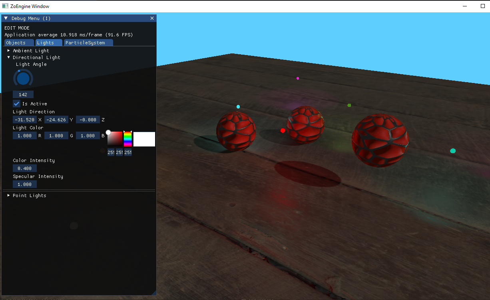

# GraphicsEngine

## Introduction

Worked on this project to implement a couple of Graphic Techniques using OpenGL. Also made use of ImGui to manipulate the different objects and settings on screen.

## How to run
 * git clone project https://github.com/zohebhynus/GraphicsEngine.git
 * Open ZoEngine.sln
 * Make sure solution configuration is set to Release
 * Press F5 to build and Run

## How to use
 * Program starts in Edit mode. Press the 'I' key to toggle between edit mode and game mode
 * Edit mode allows you to use the mouse cursor to make changes in the debug menu
 * Game mode allows you to move around the Game world
 * WASD is used to move the camera position in the game world
 * Mouse controls are used to change the camera view in game mode

## Graphic Features Developed

 * Model Loading using Assimp library
 * Textures
 * BRDF Lighting
    * Directional Lighting
    * Point Lights
 * Shadow Mapping
    * Directional Lighting
    * Point Lights
 * Transformation control using ImGui Debug Menu

## Images

 
 **Point Light Shadows**

---

 
 **Directional Light Shadow**

---

 
 **Model Object Transformation Controls**

---

 
 **Point Light Properties Controls**

---

 
 **Directional Light Properties Controls**

## Planned Work
 * Premake/Cmake solution for building project files
 * Create object flow for both model types and primitives like cube and sphere
 * Serialization to load and unload scenes
 * Particle system and Instanced Drawing
 * Forward Plus rendering using compute shader (1000+ lights)
 * Physics Engine
